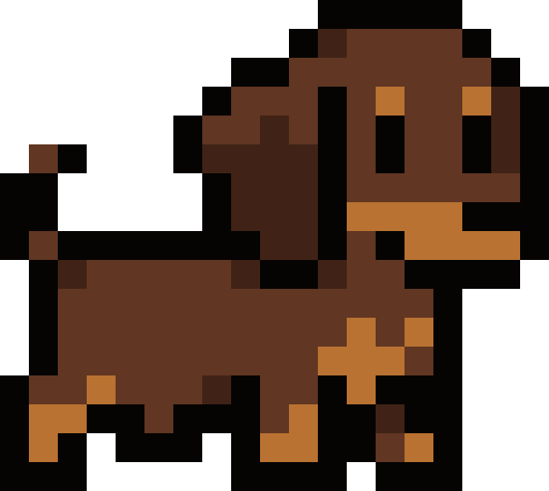

# AutoCtrl

**Automation 2026（自動化展）展示專用**的自然語言 ROS2 小車控制器。

AutoCtrl 在 NVIDIA DGX Spark 上執行，透過 ROS2 與 Zenoh bridge 控制 WHEELTEC 小車。專案獨立於 JenAI，未來也能由 JenAI 透過 `/autoctrl/command` 呼叫。



## 產品特色

- 聽懂繁體中文與常用英文的前進、後退、左轉、右轉與停止命令
- 常見命令使用確定性快速路徑，其他自然語言交由本地 `qwen3.6:35b` 判讀
- 未指定距離或角度時持續移動，直到收到停止命令
- 支援阿克曼轉向、指定距離與指定角度
- Codex 風格繁體中文 CLI 與高保真 PixPet 啟動畫面
- 單按 `Ctrl-C` 發布零速度並安全退出
- 透過 ROS2 topic 與 parameters 保留後續整合能力

## 系統角色

```text
自然語言
   ↓
AutoCtrl（DGX Spark + Qwen）
   ↓
ROS2 / Zenoh bridge
   ↓
WHEELTEC 小車
```

LLM 只負責理解命令並產生結構化移動意圖；實際速度發布、里程判斷與停止流程由確定性程式控制。

## Automation 2026 展示狀態

目前展示版的控制功能與 CLI 已鎖定。程式無法解析命令時不會產生運動，退出時會發布零速度。展場操作前仍應先架高車輪或確保周圍淨空，再依序測試停止、前進、後退與轉向。

部署需求、環境設定、小車端準備、一鍵啟動、ROS2 topics、參數調整與測試方式請參閱：

**[Automation 2026 設定與操作手冊](docs/SETUP.md)**

## 授權

Copyright 2026 rennn0223

本專案採用 [Apache License 2.0](LICENSE) 授權。
